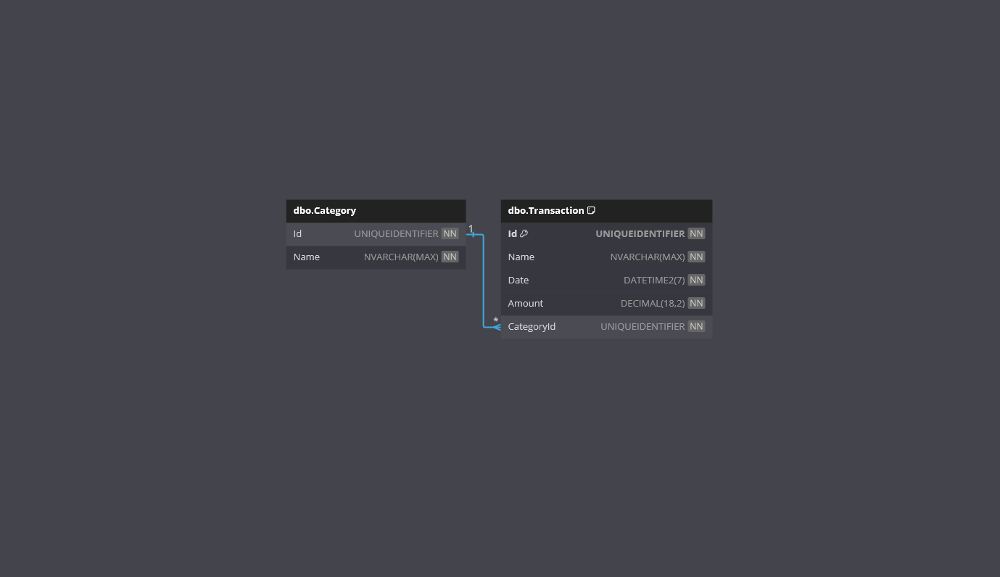

# Budget

Welcome to the **Budget** App!

This is a .NET project designed to demonstrate an ASP.NET Core MVC Web Application with a user interaction heavy front-end and an Entity Framework back end with intricated table relationships.

It allows users to view and record what transactions they have made. They can filter by Category, Name, and Date. 

## Features

- **Transaction**: Create, view, update and delete Transactions. Create/Update/Delete are modal forms!
- **Categories**: Create, view, update and delete Categories. Create/Update/Delete are modal forms! Be careful, deleting a Category deletes all associated Transactions!!
- **Filtering**: Filter Transactions by their Name and/or Date and/or Category.
- **Responsive Design**: A user-friendly interface designed to work on various devices.
- **Database Seeding**: Creates database if required and inserts some initial data.

## Technologies

- .NET
- ASP.NET MVC
- Entity Framework Core
- SQL Server
- Bootstrap
- HTML
- CSS
- JavaScript

## Getting Started

**IMPORTANT!**

The InitialCreate database migration has been created.

The web application will migrate and created the database if required.

### Prerequisites

- .NET 8 SDK.
- A code editor like Visual Studio or Visual Studio Code.
- SQL Server.
- SQL Server Management Studio (optional).

### Installation

1. Clone the repository:
	- `git clone https://github.com/chrisjamiecarter/budget.git`

2. Navigate to the project directory:
	- `cd src\budget\Budget.Web`

3. Configure the application:
	- Update the connection string in `appsettings.json` if you require.

4. Build the application using the .NET CLI:
	- `dotnet build`

### Running the Application

1. Run the application using the .NET CLI in the project directory:
	- `dotnet run`

## Usage

Once the application is running, you can:

- View Transactions or switch to Categories via the navigation bar.
- Filter transactions using the filter options.
- Create/Update/Delete records by clicking on the associated icons/buttons.

### Transactions Page

### Categories Page

## How It Works

- **Menu Navigation**: Uses MVC, JavaScript and html pages to allow users to navigate the application.
- **Data Storage**: A new SQL Server database is created and the required schema is set up at run-time, or an existing database is used if previously created.
- **Data Access**: Interaction with the database is via Entity Framework Core.
- **Data Seeding**: The [Bogus](https://github.com/bchavez/Bogus) library is used to generate fake transaction data.

## Database

